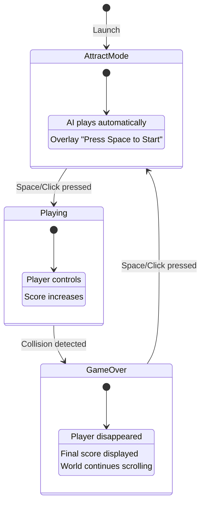

# Jump Runner - Architecture Document

## Introduction

This document outlines the complete frontend architecture for **Jump Runner**, a minimalist auto-scroller web game built with TypeScript and HTML5 Canvas. It serves as the single source of truth for AI-driven development, ensuring consistency across the entire codebase.

### Starter Template

**Decision: No starter template** - Project built from scratch with Vite + TypeScript.

**Rationale:**
- Game frameworks (Phaser, PixiJS) would add unnecessary complexity for this simple MVP
- Vite provides minimal scaffolding needed (TS, HMR, build)
- The BMAD goal is learning, not time-to-market optimization
- Vanilla Canvas allows full control over the game loop

### Change Log

| Date | Version | Description | Author |
|------|---------|-------------|--------|
| 2026-01-15 | 1.0 | Initial architecture document | Winston (Architect) |

---

## Tech Stack

### Technology Stack Table

| Category | Technology | Version | Purpose | Rationale |
|----------|------------|---------|---------|-----------|
| **Language** | TypeScript | 5.x | Static typing | Error detection, autocomplete, maintainability |
| **Runtime** | HTML5 Canvas API | Native | 2D rendering | Web standard, performant, full control |
| **Build Tool** | Vite | 5.x | Dev server + bundling | Instant HMR, minimal config, optimized build |
| **Unit Testing** | Vitest | 1.x | Unit tests | Native Vite integration, Jest-compatible API |
| **E2E Testing** | Playwright | 1.x | End-to-end tests | Cross-browser, modern API, screenshots |
| **Linting** | ESLint | 8.x | Code quality | TypeScript standard, strict rules |
| **Formatting** | Prettier | 3.x | Consistent formatting | ESLint integration, simple config |
| **Package Manager** | npm | 10.x | Dependency management | Standard, available everywhere |
| **CI/CD** | GitHub Actions | - | Automated deployment | Native GitHub Pages integration |
| **Hosting** | GitHub Pages | - | Static hosting | Free, HTTPS, simple deployment |

### Technologies NOT Used

| Category | Typical Choice | Why Not Used |
|----------|---------------|--------------|
| UI Framework | React/Vue/Angular | Canvas game, no DOM manipulation |
| State Management | Redux/Zustand | Simple game state, centralized object suffices |
| Routing | React Router | Single page, no navigation |
| CSS Framework | Tailwind/CSS Modules | Minimal CSS for overlays only |
| Component Library | shadcn/MUI | No UI components, everything in Canvas |
| API Client | Axios/fetch | No backend API |

### Game-Specific Technologies

| Category | Technology | Purpose |
|----------|------------|---------|
| **Game Loop** | `requestAnimationFrame` | 60 FPS loop synchronized with screen |
| **Delta Time** | Custom implementation | Frame-independent movement |
| **Collision** | AABB (Axis-Aligned Bounding Box) | Simple and performant detection |
| **Input** | Native `KeyboardEvent` / `MouseEvent` | Maximum responsiveness |

---

## Project Structure

```
jump-runner/
├── .github/
│   └── workflows/
│       └── deploy.yml          # CI/CD GitHub Pages
├── docs/
│   ├── brief.md                # Project Brief (Analyst)
│   ├── prd.md                  # Product Requirements (PM)
│   ├── front-end-spec.md       # UI/UX Specifications
│   ├── architecture.md         # THIS DOCUMENT
│   └── stories/                # User stories (after sharding)
├── src/
│   ├── main.ts                 # Entry point - initializes game
│   ├── config/
│   │   └── constants.ts        # Game constants (speed, gravity, colors)
│   ├── core/
│   │   ├── Game.ts             # Main class - game loop
│   │   ├── GameState.ts        # State machine (Attract/Playing/GameOver)
│   │   └── types.ts            # Shared TypeScript interfaces
│   ├── entities/
│   │   ├── Entity.ts           # Abstract base class
│   │   ├── Player.ts           # Playable character
│   │   ├── Obstacle.ts         # Obstacles (trash can, cone, car...)
│   │   └── Background.ts       # Background elements (buildings, lampposts)
│   ├── systems/
│   │   ├── PhysicsSystem.ts    # Gravity, velocity, variable jump
│   │   ├── CollisionSystem.ts  # AABB detection
│   │   ├── ScoringSystem.ts    # Real-time score
│   │   ├── DifficultySystem.ts # Difficulty progression
│   │   └── SpawnSystem.ts      # Obstacle generation
│   ├── rendering/
│   │   ├── Renderer.ts         # Main Canvas class
│   │   ├── layers/
│   │   │   ├── BackgroundLayer.ts   # Sky, buildings (slow parallax)
│   │   │   ├── GameLayer.ts         # Ground, player, obstacles
│   │   │   └── UILayer.ts           # Score, overlays
│   │   └── sprites/
│   │       ├── PlayerSprite.ts      # Player drawing
│   │       ├── ObstacleSprites.ts   # Obstacle drawings
│   │       └── BackgroundSprites.ts # Background drawings
│   ├── input/
│   │   └── InputManager.ts     # Keyboard/mouse handling
│   └── utils/
│       ├── math.ts             # Utility functions (clamp, lerp, random)
│       └── pool.ts             # Object pooling for obstacles
├── tests/
│   ├── unit/
│   │   ├── systems/
│   │   │   ├── PhysicsSystem.test.ts
│   │   │   ├── CollisionSystem.test.ts
│   │   │   ├── ScoringSystem.test.ts
│   │   │   └── DifficultySystem.test.ts
│   │   ├── entities/
│   │   │   ├── Player.test.ts
│   │   │   └── Obstacle.test.ts
│   │   └── core/
│   │       └── GameState.test.ts
│   └── e2e/
│       ├── attract-mode.spec.ts
│       ├── gameplay.spec.ts
│       └── game-over.spec.ts
├── public/
│   └── index.html              # Minimal HTML with canvas
├── index.html                  # Entry HTML for Vite
├── package.json
├── tsconfig.json
├── vite.config.ts
├── vitest.config.ts
├── playwright.config.ts
├── .eslintrc.cjs
├── .prettierrc
├── .gitignore
└── README.md
```

### Naming Conventions

| Type | Convention | Example |
|------|------------|---------|
| Class files | PascalCase.ts | `Player.ts`, `GameState.ts` |
| Utility files | camelCase.ts | `math.ts`, `pool.ts` |
| Test files | *.test.ts / *.spec.ts | `Player.test.ts` |
| Config files | camelCase.ts | `constants.ts` |
| Folders | kebab-case or camelCase | `rendering/`, `sprites/` |

---

## Entity & System Standards

### Entity Base Class

```typescript
// src/entities/Entity.ts

import { Hitbox, Position, Velocity } from '../core/types';

export abstract class Entity {
  protected position: Position;
  protected velocity: Velocity;
  protected hitbox: Hitbox;
  protected active: boolean = true;

  constructor(x: number, y: number) {
    this.position = { x, y };
    this.velocity = { x: 0, y: 0 };
    this.hitbox = this.createHitbox();
  }

  protected abstract createHitbox(): Hitbox;
  abstract update(deltaTime: number): void;

  getHitbox(): Hitbox {
    return {
      x: this.position.x + this.hitbox.x,
      y: this.position.y + this.hitbox.y,
      width: this.hitbox.width,
      height: this.hitbox.height,
    };
  }

  getPosition(): Position {
    return { ...this.position };
  }

  isActive(): boolean {
    return this.active;
  }

  deactivate(): void {
    this.active = false;
  }
}
```

### Player Entity

```typescript
// src/entities/Player.ts

import { Entity } from './Entity';
import { Hitbox } from '../core/types';
import { PLAYER, PHYSICS } from '../config/constants';

export type PlayerState = 'idle' | 'jumping' | 'falling';

export class Player extends Entity {
  private state: PlayerState = 'idle';
  private isJumpHeld: boolean = false;
  private jumpTime: number = 0;

  constructor(groundY: number) {
    super(PLAYER.START_X, groundY - PLAYER.HEIGHT);
  }

  protected createHitbox(): Hitbox {
    return {
      x: PLAYER.HITBOX_OFFSET_X,
      y: PLAYER.HITBOX_OFFSET_Y,
      width: PLAYER.HITBOX_WIDTH,
      height: PLAYER.HITBOX_HEIGHT,
    };
  }

  update(deltaTime: number): void {
    if (this.state === 'jumping' || this.state === 'falling') {
      this.velocity.y += PHYSICS.GRAVITY * deltaTime;
      this.position.y += this.velocity.y * deltaTime;

      if (this.position.y >= this.getGroundY()) {
        this.land();
      }
    }

    if (this.state === 'jumping' && this.isJumpHeld) {
      this.jumpTime += deltaTime;
      if (this.jumpTime >= PHYSICS.MAX_JUMP_TIME) {
        this.state = 'falling';
      }
    }
  }

  jump(): void {
    if (this.state === 'idle') {
      this.velocity.y = PHYSICS.JUMP_VELOCITY;
      this.state = 'jumping';
      this.isJumpHeld = true;
      this.jumpTime = 0;
    }
  }

  releaseJump(): void {
    this.isJumpHeld = false;
    if (this.state === 'jumping') {
      if (this.velocity.y < 0) {
        this.velocity.y *= PHYSICS.JUMP_CUT_MULTIPLIER;
      }
      this.state = 'falling';
    }
  }

  private land(): void {
    this.position.y = this.getGroundY();
    this.velocity.y = 0;
    this.state = 'idle';
  }

  private getGroundY(): number {
    return PLAYER.GROUND_Y - PLAYER.HEIGHT;
  }

  getState(): PlayerState {
    return this.state;
  }

  reset(groundY: number): void {
    this.position = { x: PLAYER.START_X, y: groundY - PLAYER.HEIGHT };
    this.velocity = { x: 0, y: 0 };
    this.state = 'idle';
    this.active = true;
  }
}
```

### System Template (Collision)

```typescript
// src/systems/CollisionSystem.ts

import { Hitbox } from '../core/types';
import { Player } from '../entities/Player';
import { Obstacle } from '../entities/Obstacle';

export class CollisionSystem {
  static checkAABB(a: Hitbox, b: Hitbox): boolean {
    return (
      a.x < b.x + b.width &&
      a.x + a.width > b.x &&
      a.y < b.y + b.height &&
      a.y + a.height > b.y
    );
  }

  static checkPlayerObstacleCollision(
    player: Player,
    obstacles: Obstacle[]
  ): Obstacle | null {
    const playerHitbox = player.getHitbox();

    for (const obstacle of obstacles) {
      if (!obstacle.isActive()) continue;
      if (this.checkAABB(playerHitbox, obstacle.getHitbox())) {
        return obstacle;
      }
    }

    return null;
  }
}
```

---

## Game State Machine

### State Diagram



### State Base Class

```typescript
// src/core/states/State.ts

import { Game } from '../Game';

export abstract class State {
  protected game: Game;

  constructor(game: Game) {
    this.game = game;
  }

  abstract enter(): void;
  abstract exit(): void;
  abstract update(deltaTime: number): void;
  abstract render(): void;
  abstract handleInput(action: InputAction): void;
}

export type InputAction =
  | { type: 'jump_start' }
  | { type: 'jump_end' }
  | { type: 'start_game' };
```

### State Machine Manager

```typescript
// src/core/GameState.ts

import { State } from './states/State';
import { AttractState } from './states/AttractState';
import { PlayingState } from './states/PlayingState';
import { GameOverState } from './states/GameOverState';
import { Game } from './Game';

export type GameStateType = 'attract' | 'playing' | 'gameOver';

export class GameStateMachine {
  private states: Map<GameStateType, State>;
  private currentState: State;
  private currentStateType: GameStateType;

  constructor(game: Game) {
    this.states = new Map([
      ['attract', new AttractState(game)],
      ['playing', new PlayingState(game)],
      ['gameOver', new GameOverState(game)],
    ]);

    this.currentStateType = 'attract';
    this.currentState = this.states.get('attract')!;
  }

  start(): void {
    this.currentState.enter();
  }

  changeState(newState: GameStateType): void {
    if (!this.isValidTransition(this.currentStateType, newState)) {
      console.warn(`Invalid transition: ${this.currentStateType} -> ${newState}`);
      return;
    }

    this.currentState.exit();
    this.currentStateType = newState;
    this.currentState = this.states.get(newState)!;
    this.currentState.enter();
  }

  update(deltaTime: number): void {
    this.currentState.update(deltaTime);
  }

  render(): void {
    this.currentState.render();
  }

  handleInput(action: InputAction): void {
    this.currentState.handleInput(action);
  }

  private isValidTransition(from: GameStateType, to: GameStateType): boolean {
    const validTransitions: Record<GameStateType, GameStateType[]> = {
      attract: ['playing'],
      playing: ['gameOver'],
      gameOver: ['attract'],
    };
    return validTransitions[from].includes(to);
  }
}
```

---

## Rendering Architecture

### Layer System

```
┌─────────────────────────────────────────────────────┐
│  UI Layer (score, overlays)           - Fixed      │
├─────────────────────────────────────────────────────┤
│  Game Layer (player, obstacles, ground) - 100%     │
├─────────────────────────────────────────────────────┤
│  Midground Layer (lampposts)          - 100%       │
├─────────────────────────────────────────────────────┤
│  Background Layer (buildings)         - 30-50%     │
├─────────────────────────────────────────────────────┤
│  Sky Layer (sky, stars)               - Static 5%  │
└─────────────────────────────────────────────────────┘
```

### Renderer Class

```typescript
// src/rendering/Renderer.ts

import { COLORS, CANVAS } from '../config/constants';

export class Renderer {
  private canvas: HTMLCanvasElement;
  private ctx: CanvasRenderingContext2D;
  private width: number = 0;
  private height: number = 0;

  constructor(canvasId: string) {
    this.canvas = document.getElementById(canvasId) as HTMLCanvasElement;
    this.ctx = this.canvas.getContext('2d')!;
    this.setupCanvas();
    this.handleResize();
    window.addEventListener('resize', () => this.handleResize());
  }

  private setupCanvas(): void {
    this.ctx.imageSmoothingEnabled = false;
  }

  private handleResize(): void {
    this.width = window.innerWidth;
    this.height = window.innerHeight;
    this.canvas.width = this.width;
    this.canvas.height = this.height;
  }

  clear(): void {
    this.ctx.fillStyle = COLORS.SKY;
    this.ctx.fillRect(0, 0, this.width, this.height);
  }

  getContext(): CanvasRenderingContext2D {
    return this.ctx;
  }

  getWidth(): number { return this.width; }
  getHeight(): number { return this.height; }

  getGroundY(): number {
    return Math.floor(this.height * CANVAS.GROUND_Y_PERCENT);
  }

  getPlayerX(): number {
    return Math.floor(this.width * CANVAS.PLAYER_X_PERCENT);
  }
}
```

### Rendering Pipeline

```typescript
// Render order in Game.ts

render(): void {
  // 1. Clear canvas (sky already drawn)
  this.renderer.clear();

  // 2. Buildings (slow parallax)
  this.backgroundLayer.render(this.renderer.getGroundY());

  // 3. Ground + crosswalks
  this.gameLayer.renderGround(
    this.renderer.getGroundY(),
    this.renderer.getHeight()
  );

  // 4. Obstacles
  this.gameLayer.renderObstacles(
    this.obstacles,
    this.renderer.getGroundY()
  );

  // 5. Player (if active)
  this.gameLayer.renderPlayer(
    this.player,
    this.renderer.getGroundY()
  );

  // 6-7. UI (score) and Overlays - managed by current state
}
```

---

## Input System

### InputManager

```typescript
// src/input/InputManager.ts

import { InputAction } from '../core/types';

type InputCallback = (action: InputAction) => void;

export class InputManager {
  private callback: InputCallback | null = null;
  private isJumpKeyDown: boolean = false;

  attach(callback: InputCallback): void {
    this.callback = callback;
    document.addEventListener('keydown', this.handleKeyDown);
    document.addEventListener('keyup', this.handleKeyUp);
    document.addEventListener('mousedown', this.handleMouseDown);
    document.addEventListener('mouseup', this.handleMouseUp);
    document.addEventListener('keydown', this.preventSpaceScroll);
  }

  detach(): void {
    this.callback = null;
    document.removeEventListener('keydown', this.handleKeyDown);
    document.removeEventListener('keyup', this.handleKeyUp);
    document.removeEventListener('mousedown', this.handleMouseDown);
    document.removeEventListener('mouseup', this.handleMouseUp);
    document.removeEventListener('keydown', this.preventSpaceScroll);
  }

  private handleKeyDown = (event: KeyboardEvent): void => {
    if (event.repeat) return;
    if (event.code === 'Space' && !this.isJumpKeyDown) {
      this.isJumpKeyDown = true;
      this.emit({ type: 'jump_start' });
    }
  };

  private handleKeyUp = (event: KeyboardEvent): void => {
    if (event.code === 'Space' && this.isJumpKeyDown) {
      this.isJumpKeyDown = false;
      this.emit({ type: 'jump_end' });
    }
  };

  private handleMouseDown = (event: MouseEvent): void => {
    if (event.button === 0 && !this.isJumpKeyDown) {
      this.isJumpKeyDown = true;
      this.emit({ type: 'jump_start' });
    }
  };

  private handleMouseUp = (event: MouseEvent): void => {
    if (event.button === 0 && this.isJumpKeyDown) {
      this.isJumpKeyDown = false;
      this.emit({ type: 'jump_end' });
    }
  };

  private preventSpaceScroll = (event: KeyboardEvent): void => {
    if (event.code === 'Space') event.preventDefault();
  };

  private emit(action: InputAction): void {
    if (this.callback) this.callback(action);
  }

  reset(): void {
    this.isJumpKeyDown = false;
  }

  isJumpHeld(): boolean {
    return this.isJumpKeyDown;
  }
}
```

---

## Game Configuration (Constants)

```typescript
// src/config/constants.ts

/** "Night City" theme colors (from front-end-spec.md) */
export const COLORS = {
  SKY: '#0D1B2A',
  BUILDING: '#1B263B',
  WINDOW: '#FFD60A',
  SIDEWALK: '#415A77',
  SIDEWALK_EDGE: '#778DA9',
  CROSSWALK: '#E0E1DD',
  PLAYER_BODY: '#FF6B35',
  PLAYER_HEAD: '#FF8C42',
  TRASH_CAN: '#386641',
  CONE: '#FF9F1C',
  CAR_RED: '#9B2335',
  CAR_BLUE: '#3D5A80',
  HEADLIGHT: '#FFEA00',
  UI_TEXT: '#FFFFFF',
  OVERLAY_BG: 'rgba(0, 0, 0, 0.8)',
  GAME_OVER: '#E63946',
} as const;

export const CANVAS = {
  GROUND_Y_PERCENT: 0.85,
  PLAYER_X_PERCENT: 0.20,
} as const;

export const PLAYER = {
  WIDTH: 30,
  HEIGHT: 70,
  START_X: 0,
  GROUND_Y: 0,
  HITBOX_OFFSET_X: 5,
  HITBOX_OFFSET_Y: 5,
  HITBOX_WIDTH: 20,
  HITBOX_HEIGHT: 60,
} as const;

export const PHYSICS = {
  GRAVITY: 2500,
  JUMP_VELOCITY: -800,
  MAX_JUMP_TIME: 200,
  JUMP_CUT_MULTIPLIER: 0.4,
  BASE_SCROLL_SPEED: 400,
} as const;

export const OBSTACLES = {
  TYPES: {
    TRASH_CAN: { width: 30, height: 50, jumpRequired: 'small' },
    CONE: { width: 25, height: 40, jumpRequired: 'small' },
    BENCH: { width: 60, height: 35, jumpRequired: 'medium' },
    CAR: { width: 100, height: 50, jumpRequired: 'large' },
  },
  MIN_SPACING: 300,
  SPAWN_OFFSET: 100,
} as const;

export const DIFFICULTY = {
  INITIAL_SPAWN_INTERVAL: 2000,
  MIN_SPAWN_INTERVAL: 800,
  INTERVAL_DECREASE_RATE: 50,
  INTERVAL_DECREASE_EVERY: 5000,
  PLATEAU_TIME: 60000,
} as const;

export const SCORING = {
  POINTS_PER_SECOND: 10,
} as const;

export const PARALLAX = {
  BACKGROUND_SPEED: 0.3,
  MIDGROUND_SPEED: 1.0,
} as const;

export const UI = {
  PADDING: 20,
  SCORE_FONT: 'bold 24px monospace',
  TITLE_FONT: 'bold 48px monospace',
  SUBTITLE_FONT: '18px monospace',
  SCORE_FINAL_FONT: 'bold 64px monospace',
} as const;
```

---

## Testing Strategy

### Testing Pyramid

| Level | Framework | Target | Estimated Count |
|-------|-----------|--------|-----------------|
| **Unit** | Vitest | Pure functions, calculations | ~30 tests |
| **Integration** | Vitest | System interactions | ~10 tests |
| **E2E** | Playwright | Complete user journeys | 5 tests |

### Test Coverage Goals

| Category | Target | Rationale |
|----------|--------|-----------|
| **Overall** | 70% | Reasonable for a game with visual components |
| **Systems** | 90% | Pure logic, easy to test |
| **Entities** | 80% | Some rendering mixed in |
| **Core** | 70% | State machine has side effects |
| **Rendering** | Excluded | Visual, tested via E2E screenshots |

### E2E Test Scenarios

1. **Attract Mode → Start**: Verify "Press Space" starts the game
2. **Complete game cycle**: Start → Play → Collision → Game Over → Restart
3. **Scoring**: Verify score increases during gameplay
4. **Variable jump**: Short press vs long press produces different heights
5. **Game Over**: Verify player disappears and background continues

---

## Development Workflow

### Local Setup

```bash
# Clone and install
git clone https://github.com/Lcdg/jump-runner.git
cd jump-runner
npm install

# Start development
npm run dev

# Run tests
npm run test        # Watch mode
npm run test:e2e    # E2E tests
```

### NPM Scripts

| Script | Usage | Description |
|--------|-------|-------------|
| `dev` | Daily | Dev server with HMR |
| `build` | Deploy | Production build |
| `lint` | Before commit | Check code |
| `test` | Development | Tests in watch mode |
| `test:run` | CI | Tests once |
| `test:e2e` | CI | Playwright tests |
| `ci` | Pipeline | Lint + types + tests + build |

### CI/CD Pipeline

```
PUSH TO MAIN
     │
     ▼
┌────┼────┬────────────┐
│    │    │            │
▼    ▼    ▼            │
LINT  UNIT  E2E        │
     TESTS TESTS       │
│    │    │            │
└────┼────┘            │
     ▼ (all pass)      │
   BUILD               │
     │                 │
     ▼                 │
  DEPLOY ──────────────┘
GitHub Pages

→ https://lcdg.github.io/jump-runner
```

---

## Coding Standards

### Critical Rules

- **Type everything**: No `any`, explicit return types
- **Constants centralized**: All gameplay values in `constants.ts`
- **Systems stateless**: Systems operate on entities, no internal state
- **Frame-independent**: All movement uses deltaTime
- **Object pooling**: Reuse obstacles to avoid GC spikes

### Naming Conventions

| Element | Convention | Example |
|---------|------------|---------|
| Entity class | PascalCase, singular | `Player`, `Obstacle` |
| System class | PascalCase + "System" | `CollisionSystem` |
| Sprite function | camelCase + "draw" | `drawPlayer()` |
| Constants | SCREAMING_SNAKE_CASE | `PHYSICS.GRAVITY` |
| Types/Interfaces | PascalCase | `Position`, `Hitbox` |

---

## Architecture Checklist

- [x] Tech stack defined and justified
- [x] Project structure documented
- [x] Entity/System patterns established
- [x] State machine architecture defined
- [x] Rendering pipeline documented
- [x] Input system specified
- [x] Game systems detailed (Physics, Collision, Scoring, Difficulty)
- [x] Testing strategy defined
- [x] CI/CD pipeline configured
- [x] Coding standards established

---

**Document created by:** Winston (Architect)
**Date:** 2026-01-15
**Version:** 1.0
