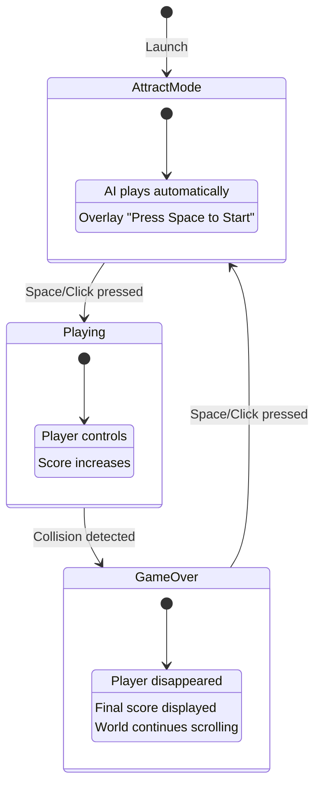

# Game State Machine

## State Diagram



## State Base Class

```typescript
// src/core/states/State.ts

import { Game } from '../Game';

export abstract class State {
  protected game: Game;

  constructor(game: Game) {
    this.game = game;
  }

  abstract enter(): void;
  abstract exit(): void;
  abstract update(deltaTime: number): void;
  abstract render(): void;
  abstract handleInput(action: InputAction): void;
}

export type InputAction =
  | { type: 'jump_start' }
  | { type: 'jump_end' }
  | { type: 'start_game' };
```

## State Machine Manager

```typescript
// src/core/GameState.ts

import { State } from './states/State';
import { AttractState } from './states/AttractState';
import { PlayingState } from './states/PlayingState';
import { GameOverState } from './states/GameOverState';
import { Game } from './Game';

export type GameStateType = 'attract' | 'playing' | 'gameOver';

export class GameStateMachine {
  private states: Map<GameStateType, State>;
  private currentState: State;
  private currentStateType: GameStateType;

  constructor(game: Game) {
    this.states = new Map([
      ['attract', new AttractState(game)],
      ['playing', new PlayingState(game)],
      ['gameOver', new GameOverState(game)],
    ]);

    this.currentStateType = 'attract';
    this.currentState = this.states.get('attract')!;
  }

  start(): void {
    this.currentState.enter();
  }

  changeState(newState: GameStateType): void {
    if (!this.isValidTransition(this.currentStateType, newState)) {
      console.warn(`Invalid transition: ${this.currentStateType} -> ${newState}`);
      return;
    }

    this.currentState.exit();
    this.currentStateType = newState;
    this.currentState = this.states.get(newState)!;
    this.currentState.enter();
  }

  update(deltaTime: number): void {
    this.currentState.update(deltaTime);
  }

  render(): void {
    this.currentState.render();
  }

  handleInput(action: InputAction): void {
    this.currentState.handleInput(action);
  }

  private isValidTransition(from: GameStateType, to: GameStateType): boolean {
    const validTransitions: Record<GameStateType, GameStateType[]> = {
      attract: ['playing'],
      playing: ['gameOver'],
      gameOver: ['attract'],
    };
    return validTransitions[from].includes(to);
  }
}
```

---
