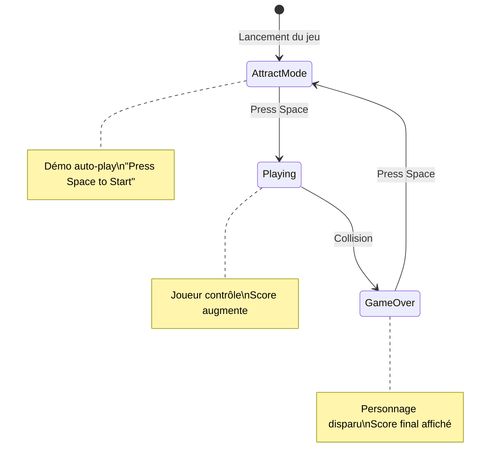

# Jump Runner - UI/UX Specification

## Introduction

Ce document définit les spécifications visuelles et d'expérience utilisateur pour **Jump Runner**, un mini-jeu auto-scroller minimaliste. Il servira de guide pour le développement frontend Canvas et garantira une expérience cohérente et engageante.

### Target User Persona

**Joueur Casual / Testeur BMAD**
- Développeur ou curieux explorant le projet démo BMAD
- Cherche une expérience de jeu rapide et satisfaisante
- Apprécie la simplicité et la rejouabilité
- Joue sur desktop avec clavier

### Usability Goals

1. **Compréhension instantanée** : Le joueur comprend le gameplay en <10 secondes sans tutoriel
2. **Réactivité parfaite** : Input → réaction visuelle en <50ms
3. **Restart sans friction** : <1 seconde entre Game Over et nouvelle partie
4. **Lisibilité totale** : Personnage et obstacles distincts dans toutes les situations

### Design Principles

1. **Minimalisme fonctionnel** - Chaque élément visuel a un but, rien de purement décoratif
2. **Contraste maximal** - Lisibilité absolue entre personnage, obstacles et fond
3. **Feedback immédiat** - Chaque action du joueur a une réponse visuelle claire
4. **Géométrie reconnaissable** - Formes simples mais identifiables : le joueur doit pouvoir reconnaître l'environnement en un coup d'œil
5. **Performance first** - Le design ne doit jamais compromettre les 60 FPS

### Change Log

| Date | Version | Description | Author |
|------|---------|-------------|--------|
| 2026-01-14 | 0.1 | Création initiale | Sally (UX Expert) |

---

## Thème : Ville de Nuit

### Ambiance visuelle

- Ciel nocturne (bleu très foncé / noir)
- Immeubles en silhouette avec fenêtres éclairées (petits carrés jaunes)
- Lampadaires avec halo de lumière
- Trottoir gris avec passages piétons (bandes blanches)

### Éléments de décor (non-obstacles)

| Élément | Description | Rôle |
|---------|-------------|------|
| **Passages piétons** | Bandes blanches horizontales sur le sol | Renforcent l'identité ville, sensation de mouvement |
| **Immeubles arrière-plan** | Silhouettes rectangulaires + fenêtres éclairées | Profondeur, ambiance nuit |
| **Lampadaires** | Poteaux avec halo lumineux | Rythme visuel, ambiance |
| **Ligne de trottoir** | Bordure claire | Délimite la zone de jeu |

### Obstacles (à éviter)

| Obstacle | Forme | Hauteur |
|----------|-------|---------|
| **Poubelle** | Rectangle gris/vert | Petit saut |
| **Borne anti-stationnement** | Cylindre court | Petit saut |
| **Cône de chantier** | Triangle orange | Petit saut |
| **Banc public** | Rectangle horizontal | Petit/moyen saut |
| **Voiture garée** | Rectangle + roues + phares | Grand saut |

---

## User Flows

### Game State Flow Diagram

### Flow 1: Attract Mode → Playing

**User Goal :** Démarrer une partie

**Steps :**
1. Le joueur voit le jeu tourner en mode démo (personnage IA qui saute)
2. Le joueur lit "Press Space to Start" au centre de l'écran
3. Le joueur appuie sur Espace (ou clic)
4. Transition immédiate : l'IA disparaît, le joueur prend le contrôle
5. Le score commence à compter

**Edge Cases :**
- Joueur clique au lieu d'appuyer sur Espace → Doit aussi fonctionner
- Joueur appuie sur une autre touche → Ignoré

### Flow 2: Playing → Game Over

**User Goal :** Jouer et survivre le plus longtemps possible

**Steps :**
1. Le joueur contrôle le personnage avec Espace/clic (saut variable)
2. Les obstacles défilent, le score augmente
3. Le joueur rate un obstacle et entre en collision
4. Transition immédiate : le personnage disparaît
5. Le décor continue de défiler (monde sans joueur)
6. Overlay "Game Over" + score final + "Press Space to Restart"

### Flow 3: Game Over → Restart

**User Goal :** Rejouer rapidement

**Steps :**
1. Le joueur voit son score final et "Press Space to Restart"
2. Le joueur appuie sur Espace (ou clic)
3. Transition vers Attract Mode
4. Reset complet : score à 0, difficulté initiale, obstacles cleared

---

## Key Screen Layouts

### Screen 1: Attract Mode

**Purpose :** Montrer le gameplay et inviter à jouer

**Key Elements :**
- Arrière-plan : Immeubles avec fenêtres éclairées (défile lentement)
- Milieu : Overlay "Press Space to Start" centré, semi-transparent
- Premier plan : Personnage IA qui joue, obstacles, trottoir avec passages piétons
- Pas de score affiché

### Screen 2: Playing (Gameplay)

**Purpose :** Le joueur contrôle et voit son score

**Key Elements :**
- Score en haut à droite, police claire et lisible
- Personnage à gauche (position fixe ~20% de l'écran)
- Obstacles variés qui défilent
- Passages piétons sur le trottoir (sensation de vitesse)
- Aucun overlay, focus sur le gameplay

### Screen 3: Game Over

**Purpose :** Montrer l'échec et inviter à rejouer

**Key Elements :**
- Overlay semi-transparent centré avec "GAME OVER"
- Score final affiché en grand
- "Press Space to Restart" en dessous
- **Personnage absent** (vide à gauche) - renforce visuellement l'échec
- Décor et obstacles continuent de défiler en arrière-plan

---

## Branding & Style Guide

### Color Palette

| Catégorie | Couleur | Hex | Usage |
|-----------|---------|-----|-------|
| **Background - Ciel** | Bleu nuit profond | `#0D1B2A` | Fond principal du ciel |
| **Background - Immeubles** | Gris anthracite | `#1B263B` | Silhouettes des bâtiments |
| **Fenêtres éclairées** | Jaune chaud | `#FFD60A` | Points lumineux sur les immeubles |
| **Sol - Trottoir** | Gris béton | `#415A77` | Zone de jeu principale |
| **Passages piétons** | Blanc cassé | `#E0E1DD` | Bandes sur le trottoir |
| **Personnage - Corps** | Orange vif | `#FF6B35` | Couleur principale du joueur |
| **Personnage - Tête** | Orange clair | `#FF8C42` | Cercle de la tête |
| **Obstacles - Poubelle** | Vert foncé | `#386641` | Rectangle vertical |
| **Obstacles - Cône** | Orange signalisation | `#FF9F1C` | Triangle + bandes blanches |
| **Obstacles - Voiture** | Rouge brique | `#9B2335` | Corps de la voiture |
| **Obstacles - Voiture** | Bleu acier | `#3D5A80` | Variante couleur voiture |
| **Phares voiture** | Jaune vif | `#FFEA00` | Cercles lumineux |
| **Lampadaires - Halo** | Jaune doux | `#FFF3B0` | Cercle semi-transparent |
| **UI - Score** | Blanc pur | `#FFFFFF` | Texte du score |
| **UI - Overlay** | Noir semi-transparent | `#000000CC` | Fond des overlays (80% opacité) |
| **UI - Game Over** | Rouge erreur | `#E63946` | Texte "GAME OVER" |

### Personnage - Design

| Partie | Forme | Couleur | Dimensions |
|--------|-------|---------|------------|
| Tête | Cercle | `#FF8C42` | Rayon = 15-20px |
| Corps | Rectangle | `#FF6B35` | 20x30px |
| Jambes | 2 rectangles | `#FF6B35` | 6x20px chacune |
| Bras (optionnel) | 2 rectangles | `#FF6B35` | 5x15px |

### Obstacles - Design

| Obstacle | Forme | Couleurs | Dimensions |
|----------|-------|----------|------------|
| **Poubelle** | Rectangle vertical | `#386641` + couvercle `#2D4A30` | 30x50px |
| **Cône** | Triangle | `#FF9F1C` + bandes `#FFFFFF` | Base 25px, hauteur 40px |
| **Borne** | Rectangle arrondi | `#778DA9` | 20x35px |
| **Banc** | Rectangle horizontal | `#5C4033` (bois) | 60x30px |
| **Voiture** | Composé | Corps `#9B2335` ou `#3D5A80`, roues `#1B1B1B`, phares `#FFEA00` | 100x45px |

### Typography

| Élément | Police | Taille | Poids | Couleur |
|---------|--------|--------|-------|---------|
| **Score (in-game)** | `"Press Start 2P"` ou `monospace` | 24px | Bold | `#FFFFFF` |
| **"Press Space to Start"** | `"Press Start 2P"` ou `monospace` | 18px | Normal | `#FFFFFF` |
| **"GAME OVER"** | `"Press Start 2P"` ou `monospace` | 36px | Bold | `#E63946` |
| **Score final** | `"Press Start 2P"` ou `monospace` | 48px | Bold | `#FFFFFF` |

### Spacing & Layout

| Élément | Position/Espacement |
|---------|---------------------|
| **Personnage (X)** | 20% de la largeur de l'écran depuis la gauche |
| **Sol (Y)** | 85% de la hauteur de l'écran depuis le haut |
| **Score** | Padding 20px depuis le coin haut-droit |
| **Overlay centré** | Centré horizontalement et verticalement |
| **Espacement obstacles** | Minimum 200px entre obstacles |

---

## Animation & Micro-interactions

### Motion Principles

1. **Réactivité immédiate** - L'animation de saut démarre dès l'input (<16ms)
2. **Physique naturelle** - Gravité et courbes d'accélération réalistes
3. **Feedback visuel clair** - Le joueur voit la différence entre petit et grand saut
4. **Performance over polish** - Aucune animation ne doit impacter les 60 FPS
5. **Subtilité du décor** - Les animations de fond ne doivent pas distraire

### Animations du Personnage

| Animation | Description | Durée | Easing |
|-----------|-------------|-------|--------|
| **Course (idle)** | Alternance des jambes | Loop 200ms | Linear |
| **Saut - Montée** | Personnage monte, jambes groupées | Variable | Ease-out |
| **Saut - Descente** | Personnage redescend | ~300ms | Ease-in |
| **Atterrissage** | Légère compression (squash) | 50ms | Ease-out |

### Animations du Décor (Parallaxe)

| Élément | Vitesse de défilement |
|---------|----------------------|
| **Ciel (étoiles)** | Statique ou 5% |
| **Immeubles (arrière-plan)** | 30-50% |
| **Lampadaires** | 100% |
| **Sol + passages piétons** | 100% |
| **Obstacles** | 100% |

### Animations UI

| Élément | Animation | Durée |
|---------|-----------|-------|
| **"Press Space to Start"** | Pulse opacité (100% ↔ 70%) | 1s loop |
| **Overlay Game Over** | Fade-in | 200ms |
| **"GAME OVER" texte** | Apparition avec delay | 300ms delay + 200ms |
| **Score final** | Scale 0.8 → 1.0 + fade | 300ms |

### Micro-interactions

| Interaction | Feedback visuel |
|-------------|-----------------|
| **Appui Espace (saut)** | Personnage décolle immédiatement |
| **Relâcher Espace** | La montée ralentit, descente commence |
| **Collision** | Flash blanc (50ms), personnage disparaît |
| **Start game** | Overlay fade-out (150ms) |

### Animation Game Over

1. Collision détectée
2. Flash blanc rapide (50ms)
3. Personnage disparaît instantanément
4. Le monde continue, overlay apparaît en fade-in

---

## Performance Considerations

### Performance Goals

| Métrique | Objectif |
|----------|----------|
| **Frame rate** | 60 FPS constant |
| **Input latency** | <50ms |
| **Page load** | <3 secondes |
| **Animation smoothness** | Aucun frame drop |

### Design Strategies

| Stratégie | Application |
|-----------|-------------|
| **Formes géométriques natives Canvas** | Pas de sprites, tout en `fillRect()`, `arc()` |
| **Object pooling obstacles** | Réutiliser les objets au lieu de créer/détruire |
| **Limite d'éléments décor** | Max 5-6 immeubles, 3-4 lampadaires visibles |
| **Parallaxe simplifié** | 2-3 couches max |
| **Pas de shadows/gradients complexes** | Couleurs pleines uniquement |

---

## Next Steps

### Immediate Actions

1. Passer à l'Architect pour créer l'architecture technique
2. Intégrer les couleurs (palette hex) dans les constantes du code
3. Choisir police "Press Start 2P" (Google Fonts) ou fallback monospace

### Pour l'Architect

- Les dimensions sont relatives, à ajuster selon le canvas final
- L'effet parallaxe nécessite 2-3 layers de rendu
- Le personnage a besoin d'une state machine (idle/jumping/falling)

### Design Handoff Checklist

- [x] User flows documentés (3 états)
- [x] Screen layouts définis
- [x] Palette de couleurs complète
- [x] Typographie définie
- [x] Personnage et obstacles spécifiés
- [x] Animations listées
- [x] Performance goals établis
- [x] Thème "Ville de Nuit" validé
